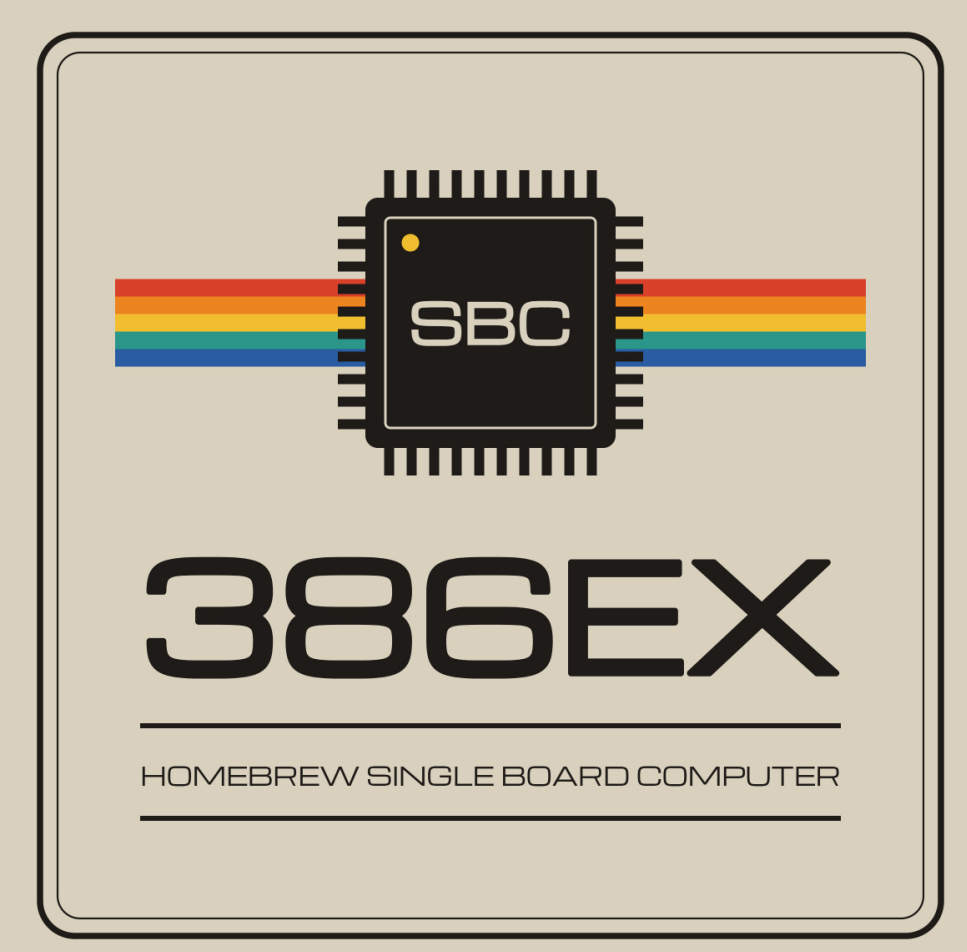

<p align="center">
  
</p>

# SBC-386EX

A single board computer built around the Intel 80386EX, an embedded 386
with most of a PC's support chips on the die. It plugs into a RetroBrew
ECB backplane or runs on its own, and with the BIOS in this repository
it boots **MS-DOS 6.22** and **COHERENT 4.2**, Mark Williams Company's
UNIX-like operating system.

**The board was designed by John Coffman** for
[RetroBrew Computers](https://www.retrobrewcomputers.org/). Its project
page, with the boards, the history and the community around it, is the
[SBC-386EX wiki page](https://www.retrobrewcomputers.org/doku.php?id=boards:sbc:sbc-386ex).
This repository holds the board's design files, its BIOS, and the
software that runs on it.

---

## The board

Version 2.0, from John Coffman's guide to the schematic
(`Hardware/SBC386ex2-schematic-guide.pdf`):

| | |
|---|---|
| CPU | Intel 80386EX, up to 33 MHz (a 66 MHz double-frequency oscillator for the fastest parts); on the board, or on an adapter board, the two footprints overlaid |
| FPU | 80387SX socket, run at the CPU's clock |
| Memory | one 72-pin SIMM, 4 to 64 MB, FPM or EDO, through a DRAM controller in two GAL16V8s; provision for a 32 KB static RAM |
| ROM | 64 KB EPROM, or 128, 256 or 512 KB flash, chosen by jumper |
| Serial | the 386EX's SIO0 at 3F8h, RS-232 on a 9-pin connector, from a 1.8432 MHz clock |
| Disk | an IDE connector laid out for a CompactFlash adapter, 8-bit programmed I/O |
| Clock | DS1302 real-time clock with battery-backed NVRAM |
| SD card | a microSD socket on the 386EX's synchronous serial unit (described on the schematic as "entirely experimental"; it works: see below) |
| Bus | 96-pin ECB connector, for RetroBrew cards: the Disk I/O V3 floppy controller, the VGA3 video and PS/2 keyboard board, and others |
| Front panel | four LEDs on port 1, a run/halt LED, reset |

The KiCad project, the schematic and board PDFs, a bill of materials and
the PLD equations are in [`Hardware/`](Hardware/).

---

## The BIOS

[`SBC386/bios`](SBC386/bios) is the board's ROM BIOS: John Coffman's,
from 2018, which brought the board up and laid the foundations, taken by
Dan Werner in 2026 to the point where it boots DOS. It gives the board a
PC-compatible BIOS interface on hardware that is not a PC:

- **POST** with a memory test and sizing, the ROM checked by CRC16 and
  then shadowed into DRAM, and the CPU clock measured
- **SETUP**, by pressing a key during POST, with its settings kept in the
  DS1302's NVRAM: disk geometry, floppy drives, the serial console, date
  and time, the boot device
- **Disks**: CompactFlash and IDE through INT 13h, CHS and the LBA
  extensions; floppy drives on the ECB Disk I/O V3, which has no DMA and
  is driven polled
- **Console**: the serial port, with VT100 translation, and the ECB VGA3
  colour display with a PS/2 keyboard, both at once
- **Clock**: INT 1Ah on the DS1302
- **A debug monitor**, SETUP entry 5, which every piece of hardware on the
  board was brought up with (commands in upper case, numbers in hex)

Notes for using it are in [`SBC386/bios/0README.TXT`](SBC386/bios/0README.TXT).
Two worth knowing first: **three Ctrl-^ in a row on the serial console
restart the board** (it has no Ctrl-Alt-Del), and **HIMEM.SYS needs
`/MACHINE:PS2`**, since there is no 8042 for it to drive A20 through.

How the BIOS went from never having run INT 13h to a DOS prompt, and why
things are as they are, is told in [`0BRINGUP.md`](0BRINGUP.md); what is
left is [`0TODO.md`](0TODO.md).

### Building the BIOS

The build runs on Linux. It needs:

| | |
|---|---|
| GNU make | |
| NASM | 2.08 is the version used; 2.09 is reported to have problems |
| Open Watcom C 1.9 | its tools on the `PATH`, and `WATCOM` set to where it is installed |
| gcc | for the build's helper programs |

1. **The helper programs** (`exe2rom`, `hex2bin`, `bin2hex`, `copt`) are
   in `SBC386/tools`, with their sources. Build them if the ones there do
   not run on your system:

   ```sh
   cd SBC386/tools
   make
   ```

2. **The ROM:**

   ```sh
   cd SBC386/bios
   make
   ```

   This builds `rom064.hex`, the 64 KB image for an EPROM, and
   `rom128.hex`, `rom256.hex` and `rom512.hex`, the same BIOS placed at
   the top of a 128, 256 or 512 KB flash part. They are Intel HEX, for
   any device programmer. `make MONITOR=0` leaves the debug monitor out,
   which frees about 25 KB of the 64 KB.

3. **Program** the part that matches the ROM jumper, fit it, and connect
   a terminal to the serial port at **9600 baud, 8 data bits, no
   parity**. POST runs there; press a key during it for SETUP.

---

## The SD card under DOS

[`SBC386/sdcard`](SBC386/sdcard) has a DOS driver for the on-board
microSD socket, and the program it was brought up with:

- **`SD.SYS`**: `DEVICE=SD.SYS` in `CONFIG.SYS` gives the card's first
  FAT12 or FAT16 partition a drive letter (DOS 4 or later)
- **`SDTEST.COM`**: the bring-up program, which tests the socket a step
  at a time, from the pins to timed reads and a write test on a sector
  outside the partition

Both build with `make` in that directory (GNU make and NASM). How the
socket was made to work, given a serial unit that only moves 16-bit
words and a clock line that floats between transfers, is set down in the
comments of `sdtest.asm`.

---

## COHERENT

[`Coherent/`](Coherent/) is a port of **COHERENT 4.2** to the board. It
comes up multi-user, with a login on the serial port and another on the
VGA3 screen and keyboard when one is fitted. Its drivers cover the
board's IDE port and CompactFlash, the ECB floppy controller (read,
write and format), the VGA3 console, and the microSD socket, so files
move to and from DOS on SD cards and diskettes.

It is installed on the board from five diskettes, the original 4.2.10
kit with a boot diskette and a supplement made for the board. **The
diskette images, the installation directions and everything about
building it are in [`Coherent/README.md`](Coherent/README.md).**

---

## What is where

| Path | |
|---|---|
| [`Hardware/`](Hardware/) | the board: KiCad project, schematic and PCB PDFs, the schematic guide, bill of materials, PLD equations |
| [`SBC386/bios/`](SBC386/bios/) | the BIOS |
| [`SBC386/tools/`](SBC386/tools/) | the BIOS build's helper programs and their sources |
| [`SBC386/sdcard/`](SBC386/sdcard/) | `SD.SYS` and `SDTEST.COM`, for the microSD socket under DOS |
| [`SBC386/ATBIOS/`](SBC386/ATBIOS/) | an IBM AT BIOS listing, the reference for what DOS expects |
| [`Coherent/`](Coherent/) | the COHERENT port: install diskettes, kernel source and changes, tools |
| [`TestROMS/`](TestROMS/), [`EX2-11/`](EX2-11/), [`386v2/`](386v2/) | John Coffman's test ROMs, early BIOS work and PLD files from the board's bring-up in 2018 |
| [`0BRINGUP.md`](0BRINGUP.md), [`0TODO.md`](0TODO.md) | the BIOS bring-up record, and what is left |

---

## Credits

- **John Coffman** designed the SBC-386EX, wrote its first BIOS and the
  tools it is built with, and brought the board up in 2018. See the
  [RetroBrew Computers wiki](https://www.retrobrewcomputers.org/doku.php?id=boards:sbc:sbc-386ex).
- **Dan Werner** took the BIOS to MS-DOS in 2026, and ported COHERENT
  with the board's drivers, including the SD cards.
- **Mark Williams Company** wrote COHERENT, released as open source in
  2015.
- The [RetroBrew Computers](https://www.retrobrewcomputers.org/) community,
  whose ECB bus and boards this one shares.

## Licence

The BIOS is free software under the GNU General Public License, version
3 or later: see [`SBC386/bios/COPYING`](SBC386/bios/COPYING). COHERENT's
own licence, and that of the work on it here, are described in
[`Coherent/README.md`](Coherent/README.md).
